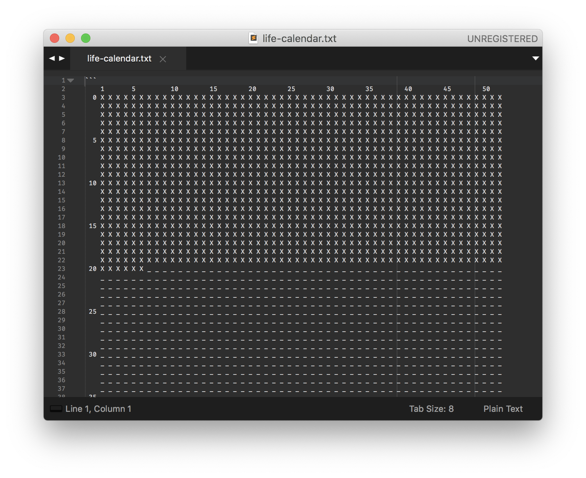

# life-calendar

`life-calendar` is a Life Calendar \[[1][blog-life-weeks]\]\[[2][youtube-procastinator]\] generator written in python.

Depends only on standard Python libraries therefore works with Python3 (haven't tried Python2 nor PyPy).

# How to run

Just type `make run bdate=YYYY-MM-DD` with your own birthday.

# Example

Using `2001-01-01` as `bdate`, 



---

(small note) I, myself, made a line of cronjob to run this file every hour,

```bash
0 * * * * cd /Users/damiann/Developer/life-calendar && make run bdate=YYYY-MM-DD
```

to keep it updated and remind myself every hour I'm being not productive (neither to myself nor others).

---

TODO:

- handle `weeks` and `years` more generally


[blog-life-weeks]: https://waitbutwhy.com/2014/05/life-weeks.html
[youtube-procastinator]: https://www.youtube.com/watch?v=arj7oStGLkU
